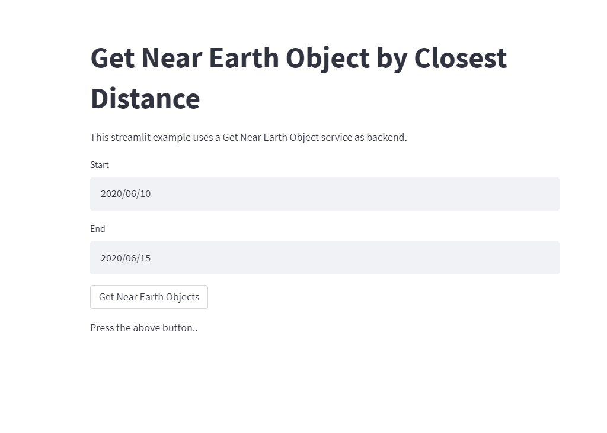
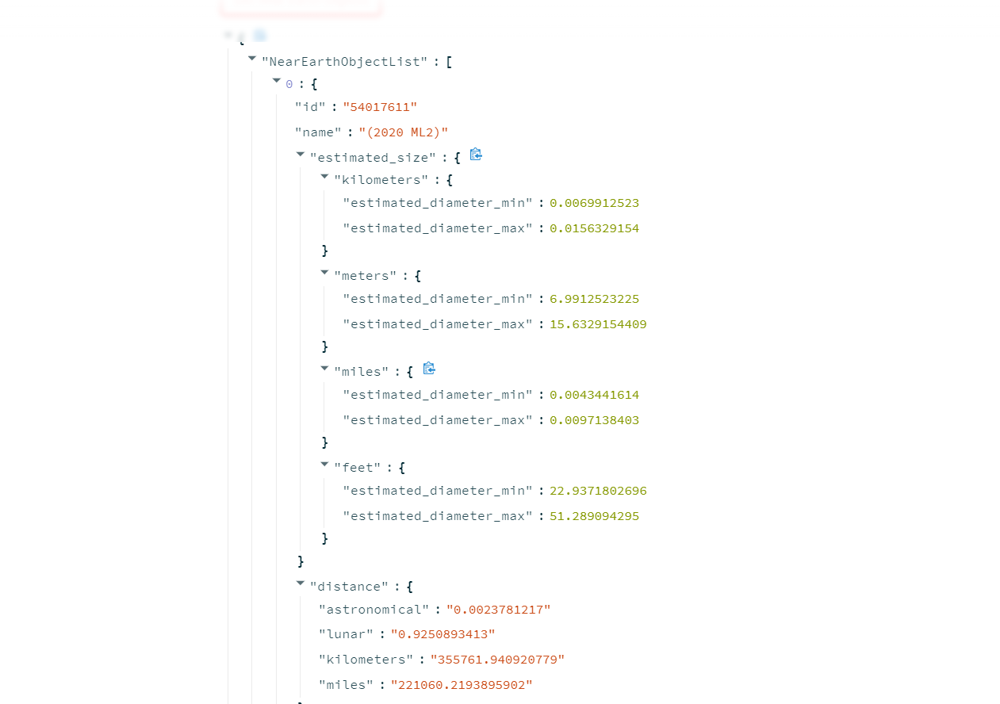

# Get Near Earth Objects From Nasa API
This project is to display information of the asteroids that are close to earth between a certain time period sorted 
by proximity to the Earth using [NASA NeoWs Web Service](https://api.nasa.gov/).

It is written as REST API using FastApi.


## Installation

Tested on : version python 3.7

```bash
conda create -n neo_nasa python=3.7
```
    
## Required packages
```bash
pip install -r requirements.txt
```


## Usage/Examples

This part explains the usage of the project.

`config_file.yaml:`

Configuration Yaml file that contains necessary informations.

```
Nasa Related Variables:
# NASA API RELATED VARIABLES

URL: 'https://api.nasa.gov/neo/rest/v1/feed?'   ## NASA NeoWs service url
API_KEY: 'kzRDhp5iVjkgRLPGbkEz19e3DbyiHOxby5n7I8np' ## demo api key
ESTIMATED_SIZE_TYPE: 'kilometers'             # estimated size types: kilometers, meters, miles, feet
SIZE_COMPARE_VAL: 'estimated_diameter_min'    # compare value can be : estimated_diameter_max, estimated_diameter_min


```

`ESTIMATED_SIZE_TYPE` : Which metric type should be using when
sorting near earth objects

`SIZE_COMPARE_VAL` : Which of the following used for sorting:
Minimum or maximum estimation for distance

```
HOST: '127.0.0.1'
PORT: 8000
DEFAULT_START_DATE: '2022-06-09'
DEFAULT_END_DATE: '2022-06-10'
```

You can change host or port values as your wish.
```
# CONSTANT ERROR MESSAGES

DATE_FORMAT_MESSAGE: 'Date format should be in YYYY-MM-DD, YYYY/MM/DD, YYYY MM DD format.'
NASA_SERVER_NOT_RESPOND: 'Nasa server response not found.'
NEAR_OBJECTS_NOT_EXIST: 'Near earth objects are not found for this request.'
NEAR_OBJECTS_EMPTY: 'Near earth objects are empty.'
NASA_SERVER_SUCCESS: 'Successfully found near earth objects from NASA server.'
```

These error messages written for controlling input data date formats.
They included config file because it's much easier to change it in here.

`utils.py:`

It contains date format checking functions and nasa service response check functions.

`near_earth_data.py:`

It contains near earth data object class. 
This class used for extracting necessary informations from 
nasa service response. 

```python
class NearEarthObject:

    def __init__(self, id, name, estimated_size, distance, approach_date):
        self.id = id
        self.name = name
        self.estimated_size = estimated_size
        self.distance = distance
        self.approach_date = approach_date

    def get_info(self):
        return self.id + ' ' + self.name + ' ' + str(self.estimated_size) + ' ' + \
               str(self.distance) + ' ' + self.approach_date
```
### REST API Usage

`get_near_objects.py` file contains REST API call. 

You can run with `python get_near_objects.py` 


```python

async def get_near_earth_objects(item: NeoWsItem):
    is_dates_correct, msg = check_dates_format(item.start_date, item.end_date)
    if not is_dates_correct:
        return {'result': msg}
    params = {
        "start_date": item.start_date,
        "end_date": item.end_date,
        "api_key": API_KEY}

    try:
        client = httpx.Client(timeout=None)
        response = client.get(NASA_URL, params=params)
        response_json = json.loads(response.text)
        response_not_empty, response_msg = check_nasa_response(response_json)
        if not response_not_empty:
            return {'result': response_msg}
        else:

            response = response_json['near_earth_objects']
            near_earth_object_list = []

            for day, objects in response.items():
                near_earth_object_list.extend([get_near_earth_object_from_dict(x) for x in objects])

            near_earth_object_list.sort(key=lambda x: x.estimated_size[
                config['ESTIMATED_SIZE_TYPE']]
            [config['SIZE_COMPARE_VAL']])
            return {'NearEarthObjectList': near_earth_object_list}
    except Exception as err:
        logging.error({'error_message': err})
        return {'result': err}

```
API could be tried with `http://127.0.0.1:8080/docs`

`get_near_objects_streamlit.py` file contains simple [streamlit](https://streamlit.io/) application for REST API.

It can be run like below:

```python
streamlit run .\get_near_earth_objects_streamlit.py
```

#### Sample Query For streamlit




Query Result:


